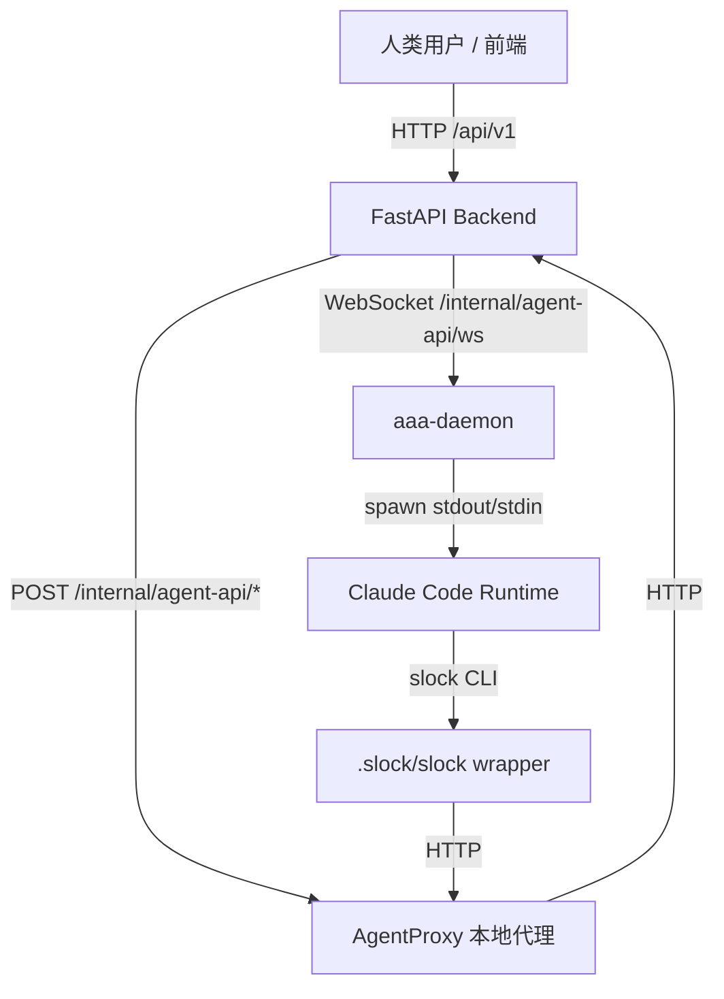
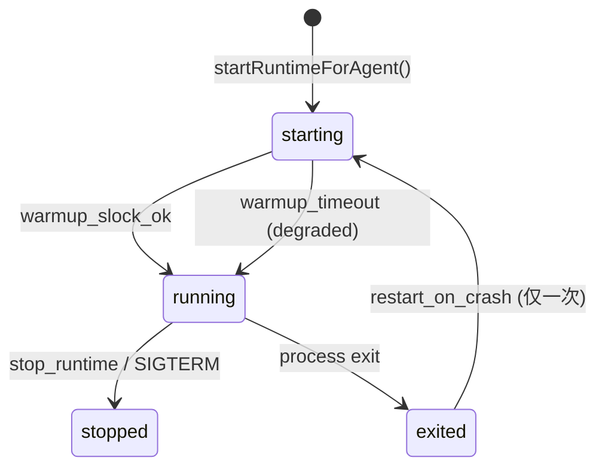
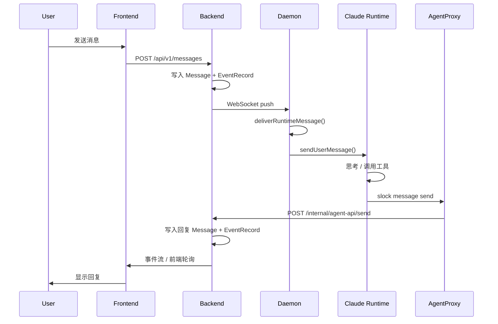

# SmallKhoj aaa-daemon 架构详解

> 范围：`agent/daemon/aaa-daemon/`
> 版本：v0.2.0
> 更新日期：2026-06-14
> 用途：掌握 daemon 的职责、数据流、runtime 生命周期和日常排查入口。

---

## 1. daemon 在系统中的位置



daemon 是**本地执行桥梁**：

- 接收 backend 的 WebSocket 控制命令（启动/停止 runtime）。
- 在本地启动 Claude Code 等 runtime。
- 为每个 runtime 生成 `.slock/slock` 命令行包装器。
- 运行本地 HTTP 代理（AgentProxy），把 runtime 的 `slock` 调用转发给 backend。
- 向 backend 注册 Computer、上报心跳、runtime 状态、活动轨迹。

---

## 2. 入口与启动流程

### 2.1 入口文件

| 文件 | 职责 |
|------|------|
| `src/cmd/main.ts` | CLI 入口，注册 `start / attach / smoke / status / stop` 命令 |
| `src/cmd/smoke.ts` | 只读集成测试，验证 proxy → backend 通路 |

### 2.2 `start` 关键选项

```bash
node dist/cmd/main.js start --foreground \
  --runtime claude \
  --server http://127.0.0.1:8000 \
  --ws auto \
  --agent-id aaaa0000-0000-0000-0000-000000000001 \
  --register-daemon
```

| 选项 | 默认值 | 说明 |
|------|--------|------|
| `--foreground` | false | 前台运行；否则自解绑为后台进程 |
| `--runtime` | `none` | `none` 不启动 runtime，`claude` 启动 Claude Code |
| `--server` | `https://api.slock.ai` | backend 地址 |
| `--ws` | `auto` | WebSocket URL；`none` 禁用并退化为轮询 |
| `--agent-id` | env `SLOCK_AGENT_ID` | 当前 daemon 身份 |
| `--proxy-port` | 0 | AgentProxy 端口，0 表示随机 |
| `--register-daemon` | false | 向 backend 注册 computer/心跳 |
| `--runtime-warmup-timeout-ms` | 120000 | runtime 启动 warm-up 超时 |
| `--runtime-stall-timeout-ms` | off | 卡住自动 kill 超时 |
| `--runtime-restart-on-crash` | false | runtime 异常退出后自动重启一次 |
| `--import-slock-runtime` | — | 导入已有 `.slock` runtime 目录的凭证/代理 |

### 2.3 启动顺序

```text
1. 加载凭证（文件 / env / --import-slock-runtime / SLOCK_CONNECT_TOKEN 一次性 ticket）
2. 写 PID 文件
3. 启动 AgentProxy，生成 .slock wrapper
4. 若 --register-daemon：调用 /internal/agent-api/daemon/register，启动 15s 心跳
5. 若 runtime=claude：启动 ClaudeRuntimeDriver
6. 启动 WebSocketManager（ws=none 则启动 3s 轮询）
7. 可选启动 MCP bridge
8. 安装 SIGINT/SIGTERM 处理器，emit ready
```

---

## 3. 核心组件

### 3.1 `DaemonCore`（`src/daemon/daemon.ts`）

单一编排器，职责：

- runtime 生命周期管理（启动、warmup、状态、重启、kill）。
- 接收 backend 控制命令（`start_runtime`、`stop_runtime`、`restart_runtime`）。
- 把 backend 事件投递给 runtime。
- 维护 2000 条环形日志 `logBuffer`。
- 上报 `activity`（working / thinking / output / idle）。
- 收集并上报 latency trace。

### 3.2 `WebSocketManager`（`src/websocket.ts`）

- 带 `Authorization` 和 `X-Agent-Id` header 连接 backend WS。
- 断线后每 5s 重连。
- 每 30s 发送 activity 心跳。
- 维护 `lastEventCursor`，重连时带 `eventLogCursor` 避免重复。
- 解析 JSON-RPC / 原始 JSON，分发 `connected / message / event / control / disconnected`。

### 3.3 `AgentProxy`（`src/proxy/agent-proxy.ts`）

本地 HTTP 代理：

- 监听 `127.0.0.1:<port>`，Bearer token 认证。
- 把 `/internal/agent/{agentId}/...` 重写成 `/internal/agent-api/...`。
- 注入 backend `Authorization` + `X-Agent-Id`。
- 对 `send` 做 **freshness hold**：如果 runtime 还没读到最新消息，返回 `409` 阻止发送。
- 暴露 `/internal/daemon/jsonrpc` 给 `attach` 命令。

### 3.4 `ClaudeRuntimeDriver`（`src/runtime/claude-runtime.ts`）

真正启动 Claude Code 子进程：

- 命令：`claude --allow-dangerously-skip-permissions --output-format stream-json ...`
- 通过 `--append-system-prompt-file` 注入 slock 使用规则。
- stdin：写入用户消息 JSON。
- stdout：解析 `stream-json` 事件流。
- 跟踪 `busy` 状态：`awaitingTurnResult || compacting || outstandingToolUses.size > 0`。
- 新发现 `sessionId` 时通知 `SessionManager`。

### 3.5 `slock` wrapper（`src/runtime/slock-wrapper.ts`）

每个 runtime 启动时在 workspace 下生成 `.slock/`：

- `slock` / `slock.cmd` / `slock.ps1`
- 设置 `SLOCK_AGENT_PROXY_URL`、`SLOCK_AGENT_PROXY_TOKEN_FILE` 等变量
- 实际调用 `node <slock-cli.js>`

token 文件保存在 `~/.slock/agent-proxy-tokens/<agentId>/<launchId>.token`。

### 3.6 `slock-cli.ts`

最小 slock CLI 实现，覆盖 `server info`、`message check/send/read`、`task`、`channel`、`reminder`、`attachment` 等命令。

写操作需要 `SLOCK_ALLOW_WRITES=1` 或 `AAA_DAEMON_ALLOW_WRITES=1`。

---

## 4. Runtime 生命周期与 Warmup 门控

这是当前 daemon 最关键的状态机。

### 4.1 状态流转



### 4.2 Warmup 机制

runtime 启动后，daemon 立即发送一条 `system.warmup` 事件：

```text
[event=system.warmup type=system]
This is a startup readiness check...
Run `slock server info` once ...
```

runtime 必须调用一个**名字或命令包含 `slock`** 的工具，并收到非错误的 `tool_result`。

- 成功：`status = running`，`ready = true`，reason = `warmup_slock_ok`。
- 超时（默认 120s）：`status = running`，`ready = true`，reason = `warmup_timeout`，并打 warn 日志。

**在 `ready = true` 之前**：

- activity 不上报（避免 warmup 工具调用污染 timeline）。
- backend 把 agent 状态显示为 `starting`（黄色）。
- 只有 warmup 成功后，agent 才真正可用。

### 4.3 为什么需要 warmup

确保 Claude Code 完成初始化、读到 system prompt、能够调用 `slock` CLI，再让它处理用户消息。否则会出现“runtime 起来了但发消息没反应”。

---

## 5. 消息 / 任务 / 事件流

### 5.1 用户发消息到 agent 回复



### 5.2 backend → daemon 的事件类型

| 事件 | 处理 |
|------|------|
| `message` | 投递给 runtime；若带 `traceId` 启动 latency trace |
| `control` | `start_runtime` / `stop_runtime` / `restart_runtime` |
| `event` | 记录到 proxy event buffer |

### 5.3 daemon 上报 backend 的活动类型

| 活动 | 触发时机 |
|------|---------|
| `runtime_working` | 消息成功投递给 runtime |
| `runtime_thinking` | warmup 后首个 `assistant` 事件 |
| `runtime_output` | 新的 `tool_use` 块 |
| `runtime_idle` | `result` 事件，附 token usage / wall-clock time |

---

## 6. 关键配置与环境变量

### 6.1 环境变量速查

| 变量 | 作用 |
|------|------|
| `SLOCK_AGENT_ID` | agent 身份 |
| `SLOCK_AGENT_TOKEN` | backend token |
| `SLOCK_SERVER_ID` | server 身份 |
| `SLOCK_CONNECT_TOKEN` | 一次性 connect ticket，触发 `/daemon/connect` |
| `SLOCK_MACHINE_ID_FILE` / `AAA_DAEMON_MACHINE_ID_FILE` | 持久化 machine UUID 文件路径 |
| `AAA_DAEMON_REGISTER` / `SLOCK_DAEMON_REGISTER` | 强制开启/关闭 daemon lifecycle 注册 |
| `AAA_DAEMON_MCP` | 启用 MCP bridge |
| `SLOCK_CCS_CLAUDE_COMMAND` / `CCS_CLAUDE_COMMAND` | 覆盖 provider 探测命令 |
| `SLOCK_ALLOW_WRITES` / `AAA_DAEMON_ALLOW_WRITES` | 允许 slock 写操作 |
| `SLOCK_WRITE_TARGET_ALLOWLIST` | 允许写的 channel/target 白名单 |

### 6.2 默认端口

| 服务 | 端口 | 说明 |
|------|------|------|
| Frontend | `:3000` | Next.js |
| Backend | `:8000` | FastAPI |
| PostgreSQL test | `:55432` | 本地测试数据库 |
| AgentProxy | 随机 | 可通过 `--proxy-port` 固定 |

---

## 7. 关键不变量与排查地图

### 7.1 关键不变量

1. **一个 Computer 同一时刻只能有一个 active daemon lease**；租约过期可重连。
2. **warmup gate 决定 runtime 是否真正 ready**；超时也会降级为 ready。
3. **crash 只自动重启一次**，防止无限循环。
4. **每个 runtime 有独立的 proxy token**，停止时注销。
5. **WebSocket 与轮询互斥**：WS 连上停止轮询，断线启动轮询。
6. **freshness hold** 会阻止 send，直到 runtime 读到最新消息。
7. **MCP bridge 只暴露 `runtime_profile_migration_done`**，真实消息流走 slock CLI。
8. **token 数量膨胀检测**：`modelUsage.cacheReadInputTokens > 3 × usage.cache_read_input_tokens` 时标记 `providerReportedInflated`。

### 7.2 常见问题排查

| 现象 | 先查什么 | 关键日志/命令 |
|------|---------|--------------|
| agent 显示 offline | 后台/heartbeat | `.dev-logs/daemon-worker-stack.log`、`backend.log` |
| agent 状态一直是 starting | warmup 是否成功 | daemon log 中 `warmup_slock_ok` / `warmup_timeout` |
| 发消息 agent 没回 | 消息是否到达 daemon | `smallkhoj-trace follow`、WS 403/连接错误 |
| runtime 异常退出 | crash / kill 原因 | daemon log 中 `exited: code=... signal=...` |
| slock send 被 block | freshness hold | proxy log 中 `pending_messages` 409 |
| provider cache 数异常 | token 膨胀 | latency trace 中 `providerReportedInflated` |

### 7.3 常用调试命令

```bash
# 跟踪完整消息流
./smallkhoj-trace follow

# 查看 daemon 汇总状态
./smallkhoj-trace summary

# 前台启动 daemon（不启动 runtime）
node agent/daemon/aaa-daemon/dist/cmd/main.js start --foreground \
  --runtime none --server http://127.0.0.1:8000 --ws auto \
  --agent-id <agent-id> --register-daemon

# 前台启动并带 Claude runtime
node agent/daemon/aaa-daemon/dist/cmd/main.js start --foreground \
  --runtime claude --server http://127.0.0.1:8000 --ws auto \
  --agent-id <agent-id> --register-daemon

# 检查本地 slock wrapper
.slock/slock server info
```

---

## 8. 变更记录

| 日期 | 变更 | 相关文件 |
|------|------|---------|
| 2026-06-07 | 全局架构归档 | `zy-think/current-architecture.md` |
| 2026-06-14 | 新增 runtime warmup 门控：`starting` → `warmup_slock_ok` → `running` | `daemon.ts`, `claude-runtime.ts`, `types.ts`, `main.ts` |
| 2026-06-14 | 新增 latency trace token 膨胀检测 | `daemon.ts` |
| 2026-06-14 | backend 状态映射修复：`idle` 黄色、`online` 绿色、缺失 runtime 置 offline | `agent_api.py`, `public_api.py` |

---

## 9. 与全局文档的关系

- `current-architecture.md`：系统全局视角，包含 Computer 连接协议、Agent 创建流程。
- `daemon-architecture.md`（本文档）：daemon 内部细节，用于排查和扩展 runtime。
- `docs/real-runtime-dm-reply-sop.md`：具体测试 SOP。
