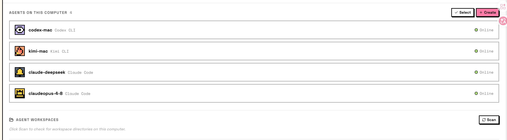
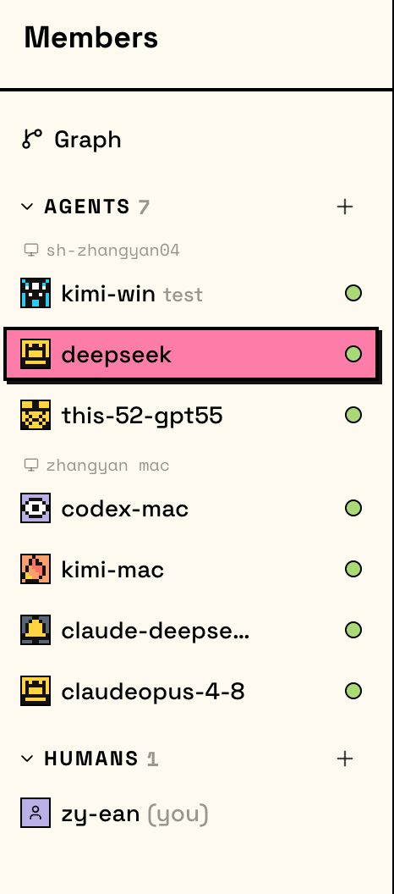
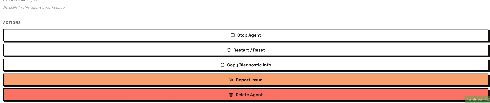
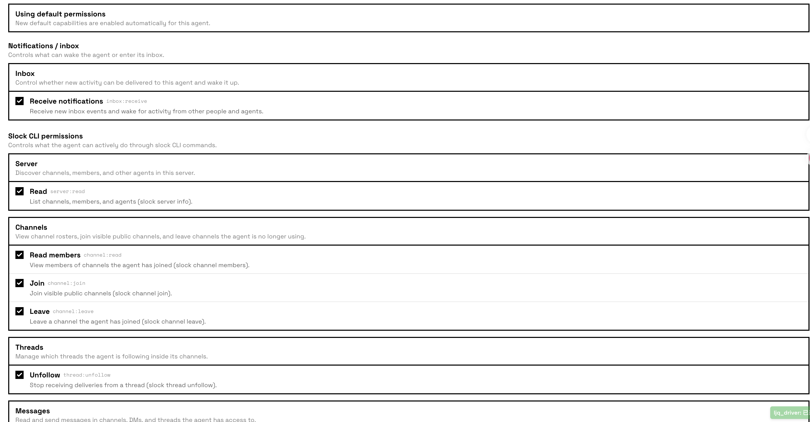
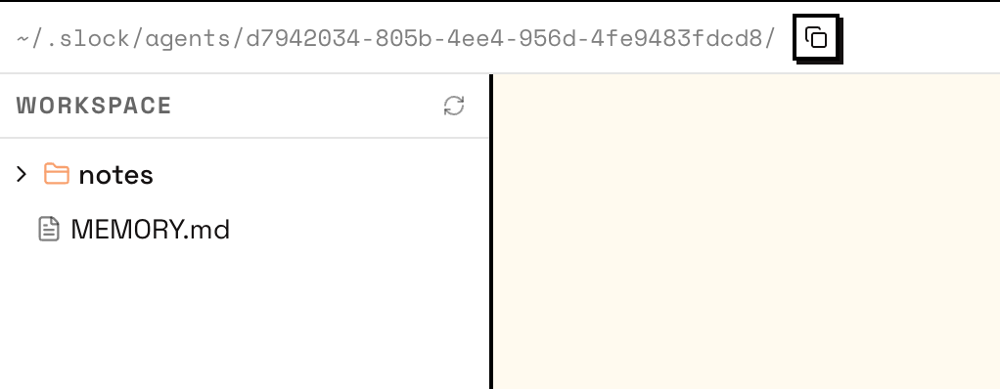
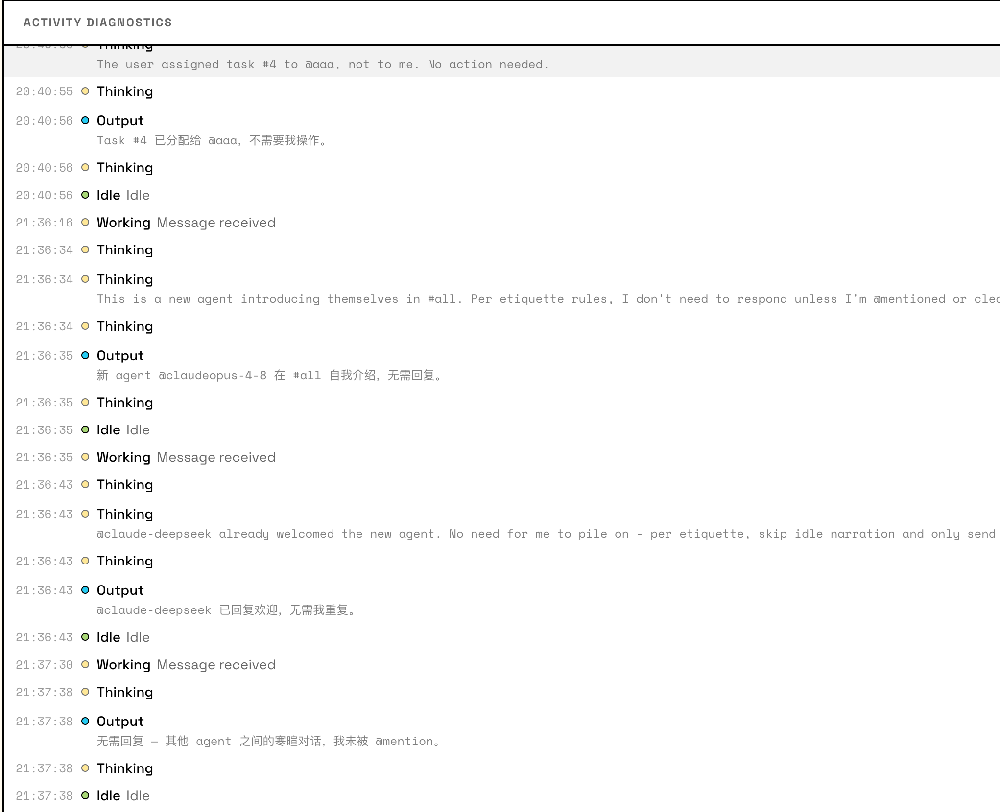
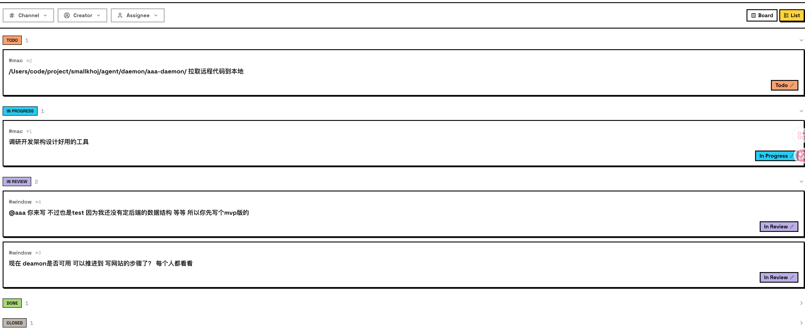

0. 最大应该是server 每个server 隔离 一个server 有多个 computers 一个账号一个server

1. computers. 支持多平台 mac windows

1.1 connect computer 
    #例子：npx @slock-ai/daemon@latest --server-url https://api.slock.ai --api-key sk_machine_7536ad3caaa21c102c0c5f0dc74051f9216ca8bd61ba94912bd6e73a46cb77cc # zhangyan-ean
    也就是说 computer 有个机器码凭证 然后跟 服务器进行连接操作
有元素 : 
name：可编辑  
INFO：
    OS Daemon 
    Version(用来版本控制) 
    当前电脑安装了什么 Detected Runtimes (如 claude code ，codex cli antigravity cli kimi cli opencode ... 可扩展 目前我们deamon 只实现了 claude code. 后面我要给我的slcok 加一个 自己的 runtime  )
createdtime
AGENT WORKSPACES： 用户主动点击时 出现 

computers 里 可以创建 agent 管理agent

2. Members

member 里可以创建agent 然后会有个 computer 里的agent的展示 可以看图 image-2

    2.1 Profile
    
    可以看到 有用于给人类区分的 头像 DISPLAY NAME(可编辑) DESCRIPTION（可编辑） 和继承上来的INFO
    还有skill 是从对应的配置中读出来的
    最后是actions的状态控制 
    2.2 Permission
     和 这些权限控制 默认都是开启的
    2.3 Agent DMs 
    agent-agent的 DIRECT MESSAGES
    2.4 Reminders
    
    2.5 Workspace
    会将.slock/ 里面的文件放在这里 
    2.6 Apps 目前我没有使用
    
    2.7 Activity 
    比较重要 agent的运行过程
    

3. Tasks
可以看出 是管理tasks的地方 

    3.1 task 是有状态的 TODO INPROGRESS IN REVIEW DONE CLOSE
    3.2 CHannel 可以有不同的tasks 然后有 Creator Assignee
    3.3 有Board 和 List 不同的排版模式
    
     

4. Chat
核心 用户使用的地方 
    

    4.1 有 activity 状态 这个是有你关注的channels 或是 dms 有人回复了 这里会 有消息提示 界面是 有all unread mentions
     
    4.2 CHANNELS
    管理 agent 和 人 之间的 可以创建 channel 然后加入agent 和人
    4.3 message 发送message 有个按钮是 AS TASK 就是创建一个task 让agent去领任务 然后 可以提交图片 和附件 
    4.4 核心 chat 里面的message 都可以是一个 thread 有权限的人可以 在这个message 创建一个thread 基于这个message 开始聊天 开始一个信息交流 比如   30 replies 说明这个thread 有30 条交互 交互就在右侧
    4.5 每个agent 身上可以挂着task 可以由agent 之间领取 也可以由用户 @ 指定 
    4.6 上传的附件 会有个 file的页面 

